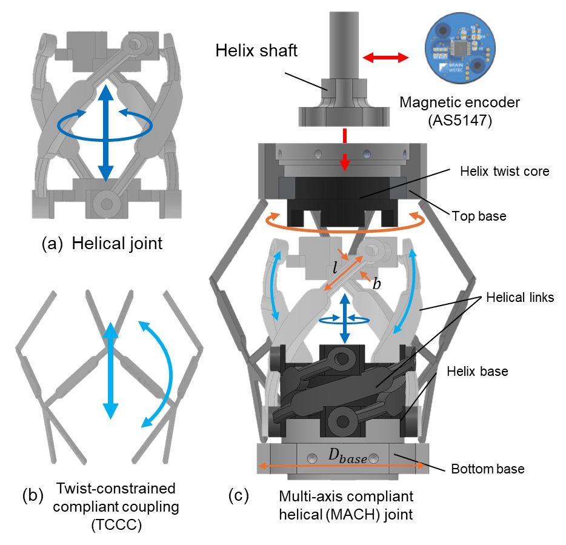
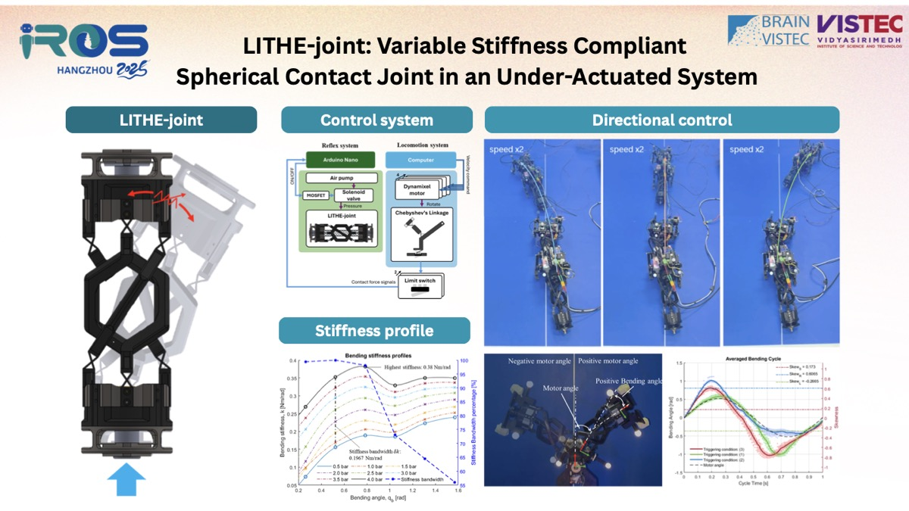
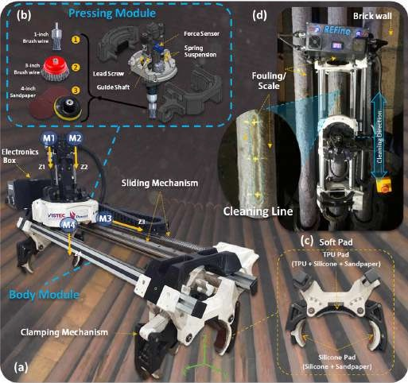

# Sanpoom Punapanont

**Research Engineer, Vidyasirimedhi Institute of Science and Technology (VISTEC)**
Bangkok, Thailand

*Physical intelligence, compliant and variable-stiffness mechanisms, embodied intelligence, and robot–environment interaction.*

🌐 **Website:** [sanpoom-p.github.io/SanpoomPunapanont](https://sanpoom-p.github.io/SanpoomPunapanont/)  
📄 **CV:** [Download (PDF)](assets/cv/CV.pdf)  
✉️ **Email:** [p.sanpoom@gmail.com](mailto:p.sanpoom@gmail.com)

---

## About

I am a Research Engineer at the Vidyasirimedhi Institute of Science and Technology (VISTEC), where I conduct robotics research in collaboration with industrial partners. My work focuses on designing, modeling, and experimentally validating variable-stiffness robotic mechanisms. I hold a Bachelor's degree in Robotics and Automation Engineering from the Institute of Field Robotics (FIBO), KMUTT, and previously worked as an engineer at Seagate Technology designing mechanical components and precision equipment for automated manufacturing.

## Education

**2018 – 2022 · Bachelor of Engineering in Robotics and Automation Engineering**  
Institute of Field Robotics (FIBO), King Mongkut's University of Technology Thonburi (KMUTT)  
GPA: 3.11

**2015 – 2018 · High School, Pre-Engineering School**  
King Mongkut's University of Technology North Bangkok

## Experience

**2023 – Present · Research Engineer**, Vidyasirimedhi Institute of Science and Technology (VISTEC)
- Conduct robotics research in collaboration with industrial partners.
- Design and experimentally validate variable-stiffness robotic mechanisms.
- Model and simulate variable-stiffness structures and their mechanical behavior.

**2021 – 2023 · Engineer**, Seagate Technology
- Designed mechanical components and precision equipment for automated manufacturing processes.
- Supported equipment development and functional testing for production lines.

## Research Projects

### MACH-joint: Multi-Axis Compliant Helical Joint

A compact helical joint whose stiffness adapts passively through fluid–structure interaction, demonstrated as an adaptive-stiffness flipper for underwater propulsion.

`Compliant mechanism` `Variable stiffness` `Underwater locomotion`

The MACH-joint integrates a helical mechanism with a twist-constrained compliant coupling to realize geometry-driven, multi-dimensional variable stiffness. Stiffness modulation emerges passively from the applied torque that controls the helical twist angle, so the joint adapts its mechanical response without additional actuation or control complexity. Implemented as an adaptive-stiffness flipper (ASF), it passively adapts its stiffness through fluid–structure interaction under constant-frequency actuation.

**Key results**
- Multi-axis variable-stiffness compliant mechanism built on a helical structure.
- Linear stiffness scales proportionally with geometric dimension, while bending stiffness scales cubically.
- The power stroke generates 30% more impulse than the recovery stroke.
- 15.32x and 3.93x faster than rigid and fixed-stiffness flippers, respectively.

**Links:** [Project page](https://sanpoom-p.github.io/SanpoomPunapanont/project.html?id=mach-joint) · [Video: Free-swimming locomotion of the adaptive-stiffness flipper](https://www.youtube.com/watch?v=1siruLQ7Fvk) · [Code: interactive simulator](https://anonymous.4open.science/r/MACH-joint)

### LITHE-joint: Variable Stiffness Spherical Contact Joint

A 2-DOF compliant spherical joint with stiffness set by a single pneumatic artificial muscle, used as the spine of a quadruped to steer its walking direction.

`Variable stiffness` `Pneumatic artificial muscle` `Under-actuated robot`

The LITHE-joint is a compact 2-DOF compliant spherical contact joint that combines a spherical rolling joint and a cross-axis flexural pivot with a parallelogram flexure mechanism. A single pneumatic artificial muscle (PAM) adjusts its stiffness, letting the joint redistribute torque and bending angle through its passive body dynamics. Embedded as the spine of an under-actuated quadruped, reflex-based stiffness control steers the robot's walking direction without changing leg speed or position.

**Key results**
- One PAM actuator controls the stiffness of a 2-DOF joint (0.5 actuators per degree of freedom).
- Stiffness of up to 0.38 Nm/rad with a stiffness bandwidth of 0.1967 Nm/rad over 0.5–4 bar.
- Range of motion of π/2 radians.
- Directional locomotion through asymmetric body stiffness without changing the basic actuation pattern.

**Links:** [Project page](https://sanpoom-p.github.io/SanpoomPunapanont/project.html?id=lithe-joint) · [Paper](https://doi.org/10.1109/IROS60139.2025.11247107)  
**Videos:** [Directional locomotion of the quadruped with a LITHE-joint spine](https://youtu.be/gBokn-a40EQ) · [Stiffness profile experiment](https://youtu.be/t08CrN0bsv0) · [Bending direction control via phase-specific PAM activation](https://youtu.be/fI0hDl4UcKo)

### REFINE-bot: Furnace Cleaning Robot

A tube-clamping robot with adaptive force control that removes scale from furnace radiant coils, deployed in a real fired heater.

`Field robotics` `Climbing robot` `Adaptive force control`

Scale accumulating on the radiant coils of oil-and-gas furnaces reduces heat-transfer efficiency and increases energy consumption. REFINE-bot is a robotic system for descaling fired heaters: an adaptable clamping mechanism fits vertical and horizontal tubes in narrow tube-to-tube and wall-to-tube gaps, and an adaptive force control adjusts the cleaning tool online to uneven scale heights. It was deployed in a real furnace and compared against traditional manual descaling.

**Key results**
- Adaptable clamping for vertical and horizontal tubes of 3–8 inch diameter.
- Three cleaning tools evaluated under simulated hard scale; the 1-inch wire cup brush removed 431.1 µm of scale, the highest descaling rate.
- Better cleaning performance than manual descaling in a real furnace, measured by scale thickness and infrared thermal imaging.
- Ultrasonic thickness measurements showed no significant loss in tube wall thickness.

**Links:** [Project page](https://sanpoom-p.github.io/SanpoomPunapanont/project.html?id=refine-bot) · [Paper](https://doi.org/10.1109/IROS60139.2025.11247011) · [Video: REFINE-bot testing in a real furnace](https://youtu.be/j2YtmNmYR8g)

## Publications

† Equal contribution

### 2026

**[T-RO]** *Under review*  
**A Multi-Axis Compliant Helical Joint for Embodied Adaptable Stiffness and Environment-Driven Interaction**  
**Sanpoom Punapanont†**, Run Janna†, Harn Sison, Poramate Manoonpong  
Manuscript under review at IEEE Transactions on Robotics (T-RO). Submitted June 2026.  
[Video](https://www.youtube.com/watch?v=1siruLQ7Fvk) · [Code](https://anonymous.4open.science/r/MACH-joint)

Abstract

Interaction with uncertain environments remains a fundamental challenge in robotics. Morphological computation offers a promising strategy by leveraging structural compliance to simplify control while maintaining adaptability. Following this principle, this study proposes a compact multi-axis compliant helical joint that features embodied adaptable stiffness. By physically integrating a helical mechanism with a twist-constrained structure, the joint realizes geometry-driven, multi-dimensional variable stiffness. The proposed design follows a stiffness scaling law in which linear stiffness scales proportionally with geometric dimension, while bending stiffness scales cubically. All stiffness modulation emerges passively from the applied torque that controls the helical twist angle, enabling adaptive mechanical responses without additional actuation or control complexity. To demonstrate joint functionality and performance, it is implemented as an adaptive-stiffness flipper and experimentally evaluated in a hydrodynamic environment under constant-frequency actuation. The joint structure passively adapts its stiffness through fluid–structure interaction and automatically produces asymmetric drag-induced impulses, with the power stroke generating 30% more impulse than the recovery stroke. This leads to 15.32x and 3.93x faster speeds than traditional rigid and fixed-stiffness flippers, respectively. The results demonstrate that the proposed mechanism can exploit coupled structure–environment dynamics to generate net directional forces without active stiffness control, highlighting its potential for adaptive robotic systems operating in uncertain environments.

### 2025

**[IROS-2025]**  
**LITHE-joint: Variable Stiffness Compliant Spherical Contact Joint in an Under-Actuated System**  
**Sanpoom Punapanont†**, Run Janna†, Harn Sison, Poramate Manoonpong  
2025 IEEE/RSJ International Conference on Intelligent Robots and Systems (IROS), Hangzhou, China, pp. 5228–5235.  
[Paper](https://doi.org/10.1109/IROS60139.2025.11247107) · [Video](https://youtu.be/gBokn-a40EQ)

Abstract

The concept of morphological computation (MC) is applied in the robotics field to improve the design and reduce the complexity of control systems. The MC uses mechanical intelligence, where stiffness properties play an important role as constraints to enhance system flexibility and to store elastic energy. This can reduce the number of required actuators. According to the MC principle, this work proposes LITHE-joint: variable stiffness compliant spherical contact joint in an under-actuated system. This compact design for a 2-degrees of freedom (DOF) compliant spherical contact joint with controllable stiffness uses a pneumatic artificial muscle (PAM). This joint requires only one PAM actuator to control stiffness in a 2-DOF system, achieving a stiffness of up to 0.38 Nm/rad with a bandwidth of 0.1967 Nm/rad. With its variable stiffness properties, the joint is able to adapt its bending behavior, enabling energy redistribution of torque and angle. The modulation of torque and bending angle is governed by joint stiffness and the passive body dynamics. The benefits of the passive, compliant joint with a variable stiffness property are demonstrated by using as the spine of an under-actuated robot, controlling the passive bending of the body and the robot's walking direction using the adjustable stiffness.

**[IROS-2025]**  
**REFINE-bot: Furnace Cleaning Robot for Heat-transfer Efficiency Improvement**  
**Sanpoom Punapanont†**, Thipawan Pairam†, Wasuthorn Ausrivong†, Poramate Manoonpong  
2025 IEEE/RSJ International Conference on Intelligent Robots and Systems (IROS).  
[Paper](https://doi.org/10.1109/IROS60139.2025.11247011) · [Video](https://youtu.be/j2YtmNmYR8g)

Abstract

In the oil and gas industry, scale accumulation on radiant coils within furnaces significantly reduces heat-transfer efficiency, leading to increased energy consumption. This paper introduces the REFINE-bot, a robotic system developed to improve the descaling process and operational efficiency in fired heaters. Unlike existing solutions which are mainly designed for specific tube sizes and positions and focused on inspection, the REFINE-bot integrates an adaptable clamping mechanism that adapts to both vertical and horizontal tubes of varying diameters (3"–8"), even in complex environments with narrow tube-to-tube and wall-to-tube gaps. An adaptive force control is also developed to online adjust the position of the cleaning relative to the tube surface to address uneven scale heights. We evaluated three different cleaning tools—a Knot End Brush, Wire Cup Brush, and Sandpaper—under simulated hard scale conditions in a lab environment. This evaluation revealed the cleaning tools' limitations and helped to identify optimal safety parameters to prevent tube damage. The results showed that the 1-inch Wire Cup Brush, removing 431.1 µm of scale, achieved the highest descaling rate among the tested tools. The robot was successfully deployed in a real furnace setting to test its clamping and cleaning mechanisms on the actual scale. The real-world results demonstrated superior cleaning performance on the radiant coils of a furnace compared to traditional manual descaling methods, as evaluated by measured reductions in scale thickness and infrared thermal imaging. Furthermore, ultrasonic thickness measurements (UTM) were performed and indicated that there was no significant loss in wall thickness after the on-site experiments.

### 2024

**[AIP Conf. Proc.]**  
**Development of 7-degree-of-freedom passive manipulator for arthroscopy**  
P. Romtrairat, et al.  
AIP Conference Proceedings, Vol. 3086, No. 1. AIP Publishing LLC, 2024.

## Skills

**Hardware:** `CAD design (SolidWorks, Fusion 360)` `Compliant mechanism design` `Pneumatic systems`  
**Modeling & Computation:** `MATLAB` `Python` `Kinematic and dynamic modeling`  
**Languages:** `Thai (native)` `English (B2, IELTS 6.5)`

## Awards & Certifications

- **2025** · VISTEC honors for outstanding achievements
- **2019 – 2021** · KMUTT Full Scholarship for Creativity and Innovation

## Contact

✉️ [p.sanpoom@gmail.com](mailto:p.sanpoom@gmail.com) · 🌐 [sanpoom-p.github.io/SanpoomPunapanont](https://sanpoom-p.github.io/SanpoomPunapanont/)

---

The website's content lives in [`data.js`](data.js); this README mirrors it. To update the site, see the [Development guide](DEVELOPMENT.md).
